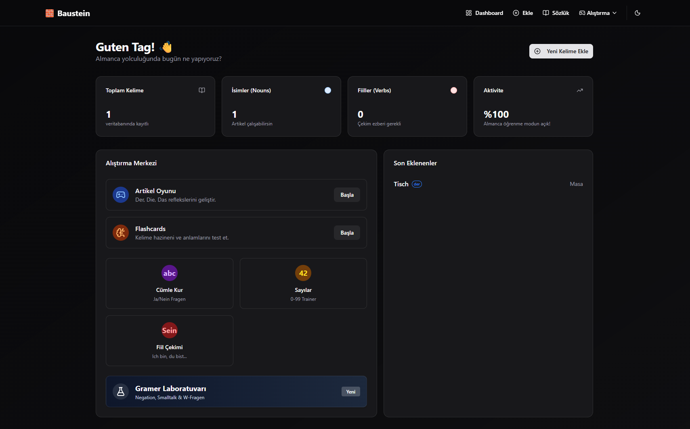

# 🧱 Baustein

> **Stein auf Stein** — Building German A1.1, one block at a time.

A developer-focused German language learning platform. Because we'd rather build custom tools than use generic apps.

[](https://opensource.org/licenses/MIT)
[](https://github.com/yigityalim/baustein/releases)
[](https://github.com/yigityalim/baustein/deployments)
[](https://nextjs.org/)
[](https://www.typescriptlang.org/)

---

## 📸 Preview



---

## 🎯 Philosophy

**Don't skip A1.1.** Master articles (der/die/das), basic verb conjugations, and sentence structure before moving forward.

**Learn by building, not by clicking.** Manual data entry (typing German words) reinforces learning better than multiple-choice buttons.

---

## ✨ Features

### 👥 Study Groups & Collaboration
- **Create study groups** with auto-generated join codes (e.g., DE-X9Y2)
- **Join groups** using invite codes from friends
- **Shared vocabulary pool** — Group members contribute to a common word database
- **Group selector** — Switch between personal area and group workspaces
- **Active group indicator** on dashboard
- **Group management page** — View members, leave groups, share invite codes

### 🏆 Gamification System
- **XP (Experience Points)** — Earn points by completing practice games
- **Daily streaks** 🔥 — Track consecutive days of studying
- **User profiles** — Username, avatar, total XP, current streak
- **Profile badge** — Shows your stats in navigation (username + 🔥 streak + ⚡ XP)
- **Automatic profile creation** on first login

### 📊 Live Leaderboard
- **Real-time ranking** within your study group
- **Top 10 display** sorted by XP
- **Medal indicators** 🥇🥈🥉 for top 3 users
- **Live updates** via Supabase real-time subscriptions
- **Visual highlights** for your position
- **Shows** username, avatar, XP, and current streak

### 🔔 Push Notifications
- **Browser notifications** when someone overtakes you in the leaderboard
- **Settings page** to manage notification permissions
- **Real-time alerts**: "🏆 Dikkat! [username] seni geçti!"
- **Permission status indicators** (Active/Disabled/Pending)
- Works seamlessly with PWA installation

### 📱 Progressive Web App (PWA)
- **Installable** on mobile and desktop devices
- **Offline support** via service worker
- **Native app experience** with app icons and splash screen
- **Home screen icon** for quick access
- **App manifest** with metadata

### 📚 Vocabulary Management
- Add words with article, plural, translation, and example sentences
- Color-coded articles: **der** (blue), **die** (red), **das** (green)
- Edit and delete entries
- Search and filter your personal dictionary
- **Group-aware filtering** — See personal or group vocabulary
- **Individual progress tracking** via word_progress table
- **Export/Import** — Backup and restore your data as JSON

### 📝 Personal Notes
- **Markdown-powered notes** — Write learning notes with formatting support
- **Tag-based organization** — Categorize notes (grammar, exam, vocabulary)
- **Pin important notes** — Keep critical notes at the top
- **Color-coded cards** — Visual organization with custom colors
- **Last updated timestamps** — Track when you last edited notes
- **Group notes** — Share notes within study groups

### 🎮 Practice Modes
- **Artikel Trainer** — Tinder-style card game for der/die/das (with progress tracking)
- **Flashcards** — Classic flip cards with translations
- **Number Trainer** — Practice German numbers (0-99)
- **Sentence Builder** — Construct German sentences from words
- **Verb Conjugation Trainer** — Practice ich/du/er/sie/es forms
- **Grammar Lab** — Negation, smalltalk, W-Fragen practice

### 🎨 Modern UI
- Dark mode support
- Fully responsive (mobile-first design)
- Smooth animations and transitions
- Progress tracking with visual feedback
- **User badge** in navigation (desktop + mobile)
- **Workspace switcher** (personal/group toggle)
- **Settings page** for app configuration

---

## 🚀 Quick Start

### Prerequisites
- Node.js 20+
- pnpm (or npm/yarn)
- Supabase account (free tier works)

### Installation

1. **Clone the repository**
   ```bash
   git clone https://github.com/yigityalim/baustein.git
   cd baustein
   ```

2. **Install dependencies**
   ```bash
   pnpm install
   ```

3. **Set up Supabase**
   - Create a new project at [supabase.com](https://supabase.com)
   - Copy `.env.example` to `.env.local`
   - Add your Supabase URL and anon key

   ```bash
   cp .env.example .env.local
   ```

4. **Create database tables**
   
   Run this SQL in your Supabase SQL Editor:

   ```sql
   -- Vocabulary table
   CREATE TABLE vocabulary (
     id UUID PRIMARY KEY DEFAULT gen_random_uuid(),
     user_id UUID REFERENCES auth.users(id) ON DELETE CASCADE,
     word TEXT NOT NULL,
     article TEXT CHECK (article IN ('der', 'die', 'das')),
     type TEXT NOT NULL DEFAULT 'noun',
     plural TEXT,
     meaning_tr TEXT NOT NULL,
     example_sentence TEXT,
     conjugation JSONB,
     mistake_count INTEGER DEFAULT 0,
     correct_count INTEGER DEFAULT 0,
     level TEXT DEFAULT 'new',
     last_practiced_at TIMESTAMPTZ,
     created_at TIMESTAMPTZ DEFAULT NOW()
   );

   -- Enable Row Level Security
   ALTER TABLE vocabulary ENABLE ROW LEVEL SECURITY;

   -- RLS Policies
   CREATE POLICY "Users can view their own vocabulary"
     ON vocabulary FOR SELECT
     USING (auth.uid() = user_id);

   CREATE POLICY "Users can insert their own vocabulary"
     ON vocabulary FOR INSERT
     WITH CHECK (auth.uid() = user_id);

   CREATE POLICY "Users can update their own vocabulary"
     ON vocabulary FOR UPDATE
     USING (auth.uid() = user_id);

   CREATE POLICY "Users can delete their own vocabulary"
     ON vocabulary FOR DELETE
     USING (auth.uid() = user_id);
   ```

5. **Run the development server**
   ```bash
   pnpm dev
   ```

6. **Open in browser**
   
   Visit [http://localhost:3000](http://localhost:3000)

---

## 🛠️ Tech Stack

- **Framework**: [Next.js 16](https://nextjs.org/) (App Router, Server Components)
- **Database**: [Supabase](https://supabase.com/) (PostgreSQL + Auth)
- **UI Components**: [shadcn/ui](https://ui.shadcn.com/)
- **Styling**: [Tailwind CSS v4](https://tailwindcss.com/)
- **Language**: [TypeScript](https://www.typescriptlang.org/)
- **Form Validation**: Zod
- **Icons**: Lucide React
- **Theme**: next-themes

---

## 📁 Project Structure

```
src/
├── app/
│   ├── (auth)/login/          # Username-based anonymous login
│   └── (main)/                # Main app with shared layout
│       ├── layout.tsx         # Navigation, sidebar, user badge
│       ├── page.tsx           # Dashboard (stats + leaderboard)
│       ├── add/               # Add new words
│       ├── vocabulary/        # Word list (filtered by workspace)
│       ├── notes/             # Personal notes (markdown)
│       ├── groups/            # Study group management
│       ├── settings/          # App settings (notifications)
│       └── practice/
│           ├── articles/      # Der/Die/Das game
│           ├── flashcards/    # Flash cards
│           ├── numbers/       # Number trainer
│           ├── sentences/     # Sentence builder
│           ├── verbs/         # Verb conjugation
│           └── grammar/       # Grammar Lab
├── components/
│   ├── ui/                    # shadcn components (Avatar, Command, etc.)
│   ├── layout/                # Nav, sidebar, UserBadge, WorkspaceSwitcher
│   ├── vocabulary/            # Word form, word list, edit dialog
│   ├── practice/              # Game components
│   ├── dashboard/             # LeaderboardCard
│   └── groups/                # CreateGroupForm, JoinGroupForm
├── lib/supabase/              # Supabase clients (server, client)
├── actions/                   # Server actions
│   ├── vocabulary-actions.ts # CRUD for words (group-aware)
│   ├── notes-actions.ts       # CRUD for notes
│   ├── game-actions.ts        # Practice games, XP tracking
│   ├── group-actions.ts       # Create/join/leave groups
│   ├── leaderboard-actions.ts # Get leaderboard (filtered by group)
│   └── profile-actions.ts     # Get user profile
├── hooks/                     # Custom React hooks
│   └── use-notification.ts    # Notification API wrapper
└── types/                     # TypeScript types (database.types.ts)
```

---

## 🎯 Roadmap

### ✅ Completed (v0.4.0)
- [x] Vocabulary CRUD operations
- [x] Artikel practice game with progress tracking
- [x] Flashcards
- [x] Number trainer
- [x] Sentence builder
- [x] Verb conjugation trainer
- [x] Grammar Lab (negation, smalltalk, W-Fragen)
- [x] Personal notes with markdown support
- [x] Dark mode
- [x] Mobile responsive design
- [x] Export/Import vocabulary and notes
- [x] **Study groups with shared vocabulary**
- [x] **Gamification (XP + streaks)**
- [x] **Live leaderboard with real-time updates**
- [x] **Push notifications**
- [x] **Progressive Web App (PWA)**
- [x] **User profiles with avatars**
- [x] **Group-aware data filtering**
- [x] **Individual word progress tracking**

### 🚧 In Progress
- [ ] Spaced repetition algorithm (using word_progress data)
- [ ] Category system (colors, days, months, body parts, etc.)
- [ ] Achievement badges (milestones, streaks, perfect games)
- [ ] Group leaderboard history charts

### 📋 Planned
- [ ] Audio pronunciation (text-to-speech for German words)
- [ ] Listening comprehension exercises
- [ ] Daily challenges and quests
- [ ] Group chat for study groups
- [ ] Profile customization (avatar upload, bio)
- [ ] Weekly/monthly XP reports
- [ ] Multiplayer games (real-time battles)
- [ ] Study reminders (push notifications for inactive users)

---

## 🤝 Contributing

Contributions are welcome! Whether it's:
- Adding German vocabulary lists
- Fixing bugs
- Improving UI/UX
- Adding new practice modes
- Documentation improvements

Please feel free to open issues or submit pull requests.

---

## 📝 License

MIT License - see [LICENSE](LICENSE) file for details.

---

## 🙏 Acknowledgments

Built with ❤️ for developers learning German A1.1.

> "The goal is to learn German, not to build the perfect app."

- ❌ UI/UX ile saatler harcama
- ❌ Yeni bir framework öğrenmeye çalışma
- ✅ Veriyi (kelimeleri) elle gir — veri girişi çalışmanın bir parçasıdır
- ✅ A1.1'i "teknik borç" bırakmadan bitir
